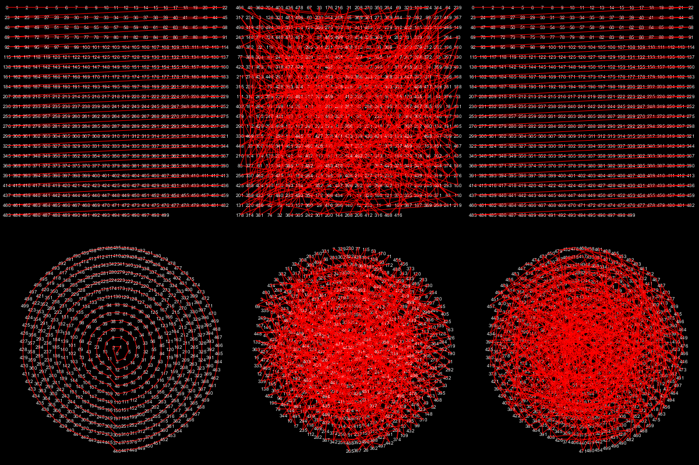

# Data Ordering Experiments

attempting to order a Vector array back to it's original order based on particular orders.

Thank you [jeremydouglass](https://github.com/jeremydouglass) for sharing [here](https://discourse.processing.org/t/sort-pvector-array-by-distance/4737/6) the code for the `VecArrayTool.pde` used in this experiment.

